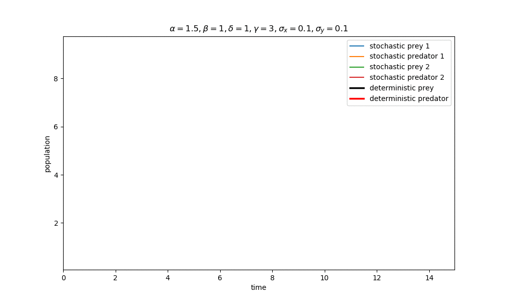
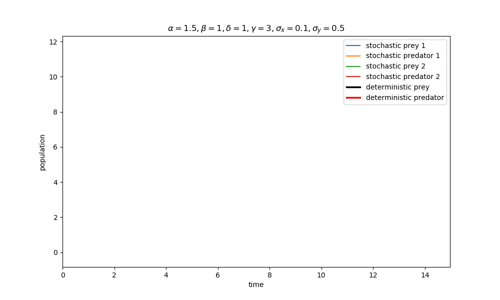
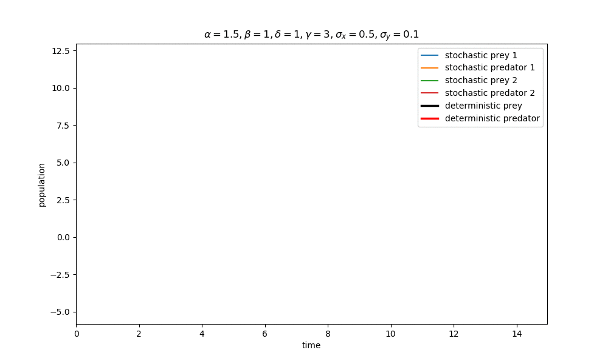

### Simulation of Lotka-Volterra model with stochastic component

[Deterministic Lotka-Volterra model](https://en.wikipedia.org/wiki/Lotka%E2%80%93Volterra_equations) has form:

Where `x` - number of prey, `y` number of predator.

Adding to the equations the stochastic component:

We can solve this equations using numerical approach (Euler-Maruyama method)

Where  is Wiener process (),  and  are constants.

### Results for: 

|   	|   	|
|:------------------------:	   |  :-------------------------:	|
|   	|   	|